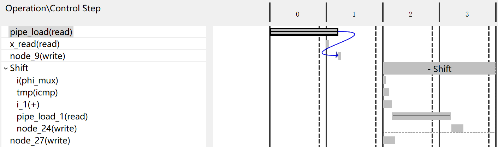
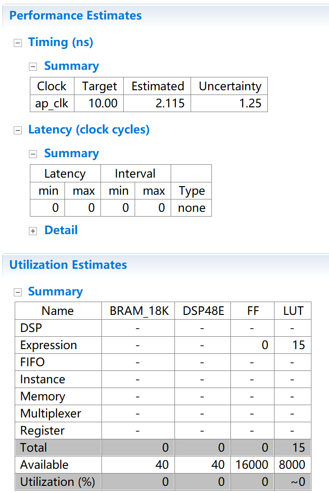
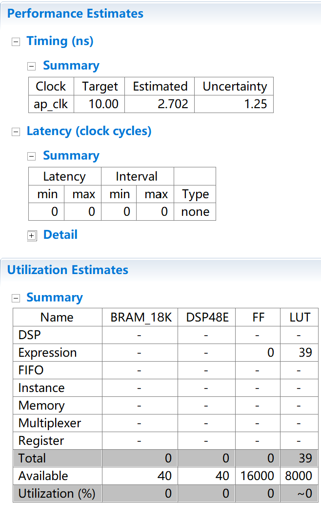
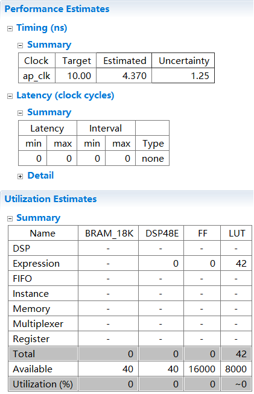
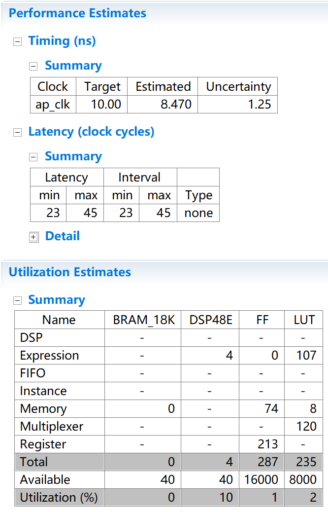

# FIR
------
### experiment1 FIFO:



```
#include "ap_int.h"
#define N 8

void fifo(int x,int *y){
    static int pipe[N]={0};
    *y=pipe[N-1];//在2个周期内完成，其中pipe_load(read)耗时最长
    Shift:
    for(int i=N-1;i>0;--i){//重复7次
        pipe[i]=pipe[i-1];//在2个周期内完成，其中pipe_load_1(read)耗时最长
    }
    pipe[0]=x;//在1个周期内完成
}
```
pipe_load(read)耗时较长的原因可能是和它是和内存进行通信的，而不是DDR、BRAM这种存储设备。

------
### experiment2 SimpleAdd
|char|short|int|long|
|-|-|-|-|
|||||

|long long|float|double|
|-|-|-|
||||
不难发现：<br>
- 此处使用的int类型即long类型
- 有些类型切换只影响组合逻辑的耗时，不影响时钟周期的消耗。而改为float和double就会产生周期延时。

------
### experiment3 SimpleMul
|char|short|int|long|
|-|-|-|-|
|||||

|long long|float|double|
|-|-|-|
||||

当数据类型为long long时出现了意外。此前的latency和interval都是0，而到了long long这里就变成了4，可见由于DSP乘法位宽的限制，系统切分了long long数据，从而形成了4个周期的延时。
float和double的情况和加法一致。

------
|version1|version2|version3|version4|version5|
|-|-|-|-|-|
||||||
||||||
||||||

（coef_t、data_t、acc_t均为int）

（由于Vivado_HLS的设计问题，Simulation的结果同一时间只能显示一个Pass，另一个必然是未定义值NA，不代表没有通过。）

相比version1，version2所做的是循环拆分。原本使用一个for循环，循环内完成AB两件事。现在使用两个时间先后关系的for循环，一个专门用来完成A，一个专门用来完成B。

据教程介绍，相比version2，version3所做的实际上是手动unroll，即通过修改设计的方式等效达到#pragma UNROLL的效果。这较为清晰地展现了UNROLL完成的操作，也能够让人据此分析出为什么HLS对for循环做UNROLL展开要求循环次数确定已知。而version4则是基于version2的使用HLS指令的循环展开（即UNROLL）。

但是实验下来却不是这样。手动UNROLL和代码UNROLL的效果并不相同。推测的原因是，#pragma UNROLL可以对付本身就具有并行性的语句，例如TDL循环，但对于MAC循环中的累加操作则不具有自动优化的能力。

|version3|version4|version6|
|-|-|-|
||||
||||
||||

修改后，version6的各项数据与version3完全一致。

关于version5，通过在指令中指定优化参数 skip_exit_check ，Vivado HLS将不会增加对循环最后部分迭代运算的检查。此指令的效果在version5中没有体现，因为此次设计中，循环并不是永远用不到最后部分的迭代，即循环次数N并不完全整除factor。

<details>
  <summary>一处原文刊误</summary>
  在<a href="https://xupsh.gitbook.io/pp4fpgas-cn/zheng-wen/02-finite-impulse-response-filters">原文第二章 FIR滤波器</a>中，有一行重复内容，影响最终计算正确性。<br>
  
</details>