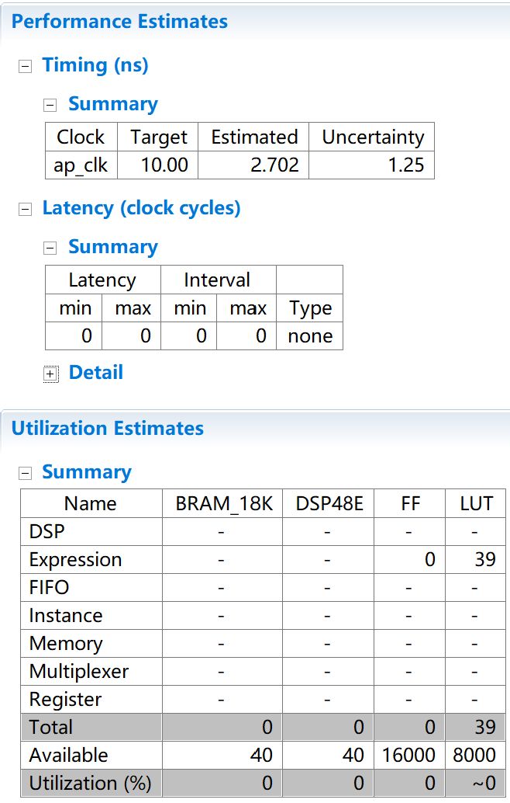

# FIR

### experiment1 FIFO:


```
#include "ap_int.h"
#define N 8

void fifo(int x,int *y){
    static int pipe[N]={0};
    *y=pipe[N-1];//在2个周期内完成，其中pipe_load(read)耗时最长
    Shift:
    for(int i=N-1;i>0;--i){//重复7次
        pipe[i]=pipe[i-1];//在2个周期内完成，其中pipe_load_1(read)耗时最长
    }
    pipe[0]=x;//在1个周期内完成
}
```
pipe_load(read)耗时较长的原因可能是和它是和内存进行通信的，而不是DDR、BRAM这种存储设备。

### experiment2 SimpleAdd
数据类型为char时：


数据类型为short时：


数据类型为int时：


数据类型为long时：


数据类型为long long时：


不难发现：<br>
- 此处使用的int类型即long类型
- 这样的类型切换只影响组合逻辑的耗时，不影响时钟周期的消耗。

### version1:


### version2: