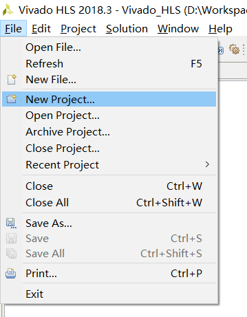

# Vivado_HLS创建工程的步骤示例

以Chapter2_FIR的version1为例。

#### 1，新建工程



或者


个人习惯将工程统一命名为Vivado_HLS，因为将庞大的工程文件放在GitHub上并不明智，因此在.gitignore文件中指定忽略名为"Vivado_HLS"的文件夹及其子文件。

提醒一下刚入门的盆友，Vivado和Vivado_HLS是不同的软件。不要认为Vivado_HLS是隶属于Vivado之下的。打开Vivado是找不到Vivado_HLS的。

#### 2，设置路径和工程名


路径下会新建以工程名为名的文件夹。一般来说，整个工程创建完毕后，目录如下：

```
│  fir.cpp
│  host.cpp
│
└─Vivado_HLS
    │  .cproject
    │  .project
    │  vivado_hls.app
    │
    ├─.apc
    │  │  autopilot.apfmapping
    │  │
    │  ├─.src
    │  └─.tb
    ├─.settings
    │      language.settings.xml
    │      Vivado_HLS.Debug.launch
    │      Vivado_HLS.Release.launch
    │
    └─solution1
        │  directives.tcl
        │  script.tcl
        │  solution1.aps
        │  solution1.directive
        │
        └─.tcls
```

其中fir.cpp为源文件，host.cpp为TestBench文件。

#### 3，添加源文件

即你所编写的基于C/C++的HLS代码。


一般来说，如果只有一个文件，则书写时将文件名和主要函数名设为一致。此乃编程规范。

#### 4，添加TestBench文件


Vitis中有一个习惯，即认为运行在FPGA上的HLS代码和运行在CPU上的C++代码是以kernel-host的方式协同运行的，因而此处的TestBench文件命名为host。

#### 5，设定目标硬件平台


点进省略号自己找。本GitHub项目主要是纸上谈兵所以不管平台型号，如果要实地运行，应当设定成正确的平台版本。

如果不知道自己的平台版本，可沿Vivado$\rightarrow$Hardware Manager$\rightarrow$Open target调出Vivado的自动探测功能，寻找已经连接的硬件平台。【未测试过，可能有误。】

solution（解决方案）是Vivado_HLS中的一个概念，由于HLS指令是通过#pragma语法附加在C++代码上，因而同一段C++代码可以有多种优化方式，例如循环展开和流水线。方便起见，Vivado_HLS为此作出了“一段C++代码，多种优化方式（解决方案）”的设计。在新建工程时，至少需要有一个solution，此处不必管它的名字。（事实上之后用得到多种解决方案的时候，通常也不会费尽心思取名字，一般会直接按次序新建solution2、solution3等。）